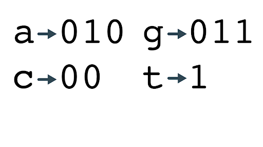

# GOFLAKE




> A highly scalable, customizable, and serverless unique ID generator for use in distributed systems. Written in GoLang. Inspired by Twitters Snowflake. 
<br>
GoFlake is a small library that quickly generates unique identifiers in the microservices space that don't require an additional server to operate. It is based off of Twitters Snowflake project. 

* Its criteria are : 
    * A check digit
    * An epoch time in Milliseconds
    * A service number
    * A process ID for the machine
    * A sequence number. 
<br>
<br>
The Check digit uses 0 by default. The purpose for it is for auditing. You can set the checkdigit to a 1 later if you wish and observe all IDs that were generated with a 1. Use it as an event code if you would like. Its your call.
<br>
<br>
Running things on the same clock in distributed systems is a tough problem to solve. An Epoch time is used. The Epoch time is set in ``components/epoch.go`` . Set an epoch time in milliseconds that you would consider your microservice's Epoch and whenever an object is created the time since then in milliseconds will be generated into the IDs field.
<br>
<br>
A service number is used to determine where the object created is being used. For example ``311`` . In my Microservice 3 is for the Comments Service. 1 for the REST protocol. and 1 for the Deployment method - localhost. This can be tailored to your liking.
<br>
<br>
The process ID is the next field and is taken from the machine that is running the service
<br>
<br>
Finally a 5 digit random sequence number adds a 5 character string with : a-z A-Z 0-9
<br>
<br>
A generated Identifier would look like this : ``0-14591498880493-0311-425471-43Que``

<br>
<br>
<br>

## Installation

Linux:

If you have GoLang installed. Clone the repository, CD into it and :

```sh
go run main.go 
```
This should run an example.

Copy the ``generator`` and ``components`` packages into your folder. Add them into ``mod.go`` to use GoFlake in your microservice. The packages also come with full code coverage.


## Usage example

```sh
func main () {

	for i := 0; i <= 100; i++ {
		fmt.Println(generator.GenerateIdentifier())
	}

}
```

Set your options in the ``generator/generateid.go`` and then the ``GenerateIdentifier()`` function returns a unique identifier.

Additional documentation is available through ``godoc``. http://localhost:6060 and can be found under "Third Party"


## Release History

* 1.0.0
    * Minimum Viable Product


## Meta

James Hart – Hart87@gmail.com

Distributed under the Apache license. See ``LICENSE`` for more information.

[https://github.com/hart87/goflake](https://github.com/hart87/goflake)

## Contributing

1. Please submit any pull requests on the master branch. If you add a feature, please submit it with a passing test. 

<!-- Markdown link & img dfn's -->
[npm-image]: https://img.shields.io/npm/v/datadog-metrics.svg?style=flat-square
[npm-url]: https://npmjs.org/package/datadog-metrics
[npm-downloads]: https://img.shields.io/npm/dm/datadog-metrics.svg?style=flat-square
[travis-image]: https://img.shields.io/travis/dbader/node-datadog-metrics/master.svg?style=flat-square
[travis-url]: https://travis-ci.org/dbader/node-datadog-metrics
[wiki]: https://github.com/yourname/yourproject/wiki